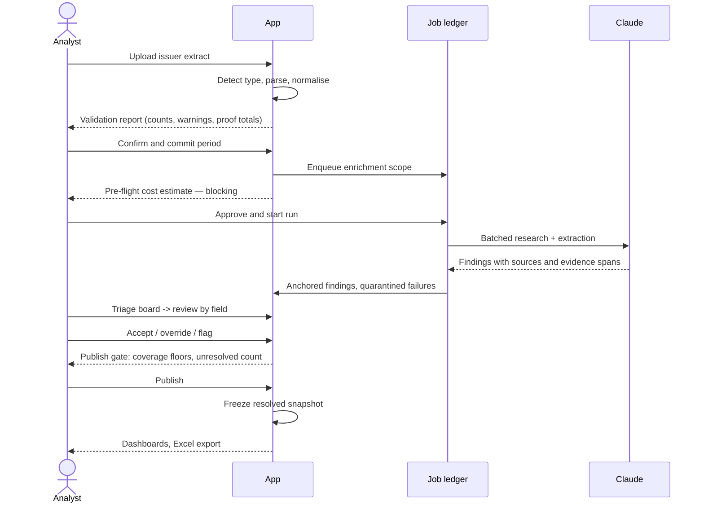

# Three roles, two journeys, and one bottleneck worth removing

## The users

| Role | Who | What they do | What they must never see |
|---|---|---|---|
| **Admin** | Practice operations lead | Manages users and roles, sets the period threshold, raises budget caps, overrides a blocked publish with a recorded reason | — |
| **Analyst** | The person who does the quarterly refresh today | Uploads the source file, runs enrichment, reviews and accepts or overrides every AI value, publishes the period | — |
| **Viewer** | Partners and practice leads | Read published dashboards, open a company profile before a pursuit conversation, export | Unpublished findings, draft periods, another period's in-flight data |

The role split is deliberately coarse because the pilot group is small. The design constraint that matters is not granularity but **enforcement**: section 6 places the Viewer restriction in database policy rather than in interface logic, because a Viewer who can sign in can otherwise reach draft data through the data API regardless of what the interface renders.

## The bottleneck

The workbook's own Instructions tab lists four refresh steps and **documents no research step at all** — the numbering skips from 3 to 5. Yet research is where the quarter stalls. The evidence is in the file: stage flags blank for 242 of 259 companies, fee columns empty for all 259, and a dashboard marked not updated.

The job to be done is therefore narrower and sharper than "build a whitespace tool". It is: **turn an undocumented, unbounded research task into a bounded review task.** The application does not decide which companies are worth pursuing. It produces evidence-backed proposals and makes accepting or rejecting them fast enough to finish inside a quarter.

## Journey one — the quarterly refresh

Four properties of this journey are load-bearing:

1. **The validation report precedes the commit.** The Analyst sees what changed, what was carried forward and what failed to reconcile before anything is written.
2. **The cost estimate blocks.** Scope selection shows the company count, the estimated spend and the estimated duration, and a full-scope re-run requires a second confirmation. Section 11 explains why this is a security control and not a convenience.
3. **Review is a triage board, not a grid.** Roughly 2,590 values per period; section 9 explains why the shape of this screen decides whether the period ever gets published.
4. **Publish freezes.** A published period is immutable and is the only thing a Viewer can read. Corrections become amendments with a recorded reason.

## Journey two — preparing for a pursuit conversation

A partner has a meeting with a company tomorrow. They open its profile and need, in one screen: tier and the **rule trace** that produced it, footprint, auditor and whether Deloitte holds the audit, fee history where known, what changed since last period, and the evidence behind every AI-derived value.

This journey inverts the review workspace's default. Review is **field-major** — one field, all companies, because that is how 2,590 decisions get made efficiently. Pursuit prep is **company-major** — one company, all fields. Both views read the same resolved values; only the axis differs.

Two things this journey requires that the workbook cannot provide:

- **A defensible answer to "why this tier?"** — hence the structured rule trace in section 7, stored as data rather than as a sentence, so it can also be diffed period over period.
- **An honest answer to "is this current?"** — a value inherited from an earlier period must be visibly inherited, with its age, or research from two years ago silently presents as this quarter's work.

## What the roles imply for the Azure move

Authorisation never reads the identity provider's user table directly. An application-level user table is the source of truth, and policies resolve the current role from a single token claim. Swapping the pilot's own sign-in for Deloitte's identity provider then changes the claim source and nothing else. That held when the pilot's sign-in was a mailed link and still holds now that it is a password, which is the first real evidence the indirection was worth its weight. That indirection looks unnecessary at pilot scale and is the entire substance of the "configuration change, not a rewrite" commitment.
