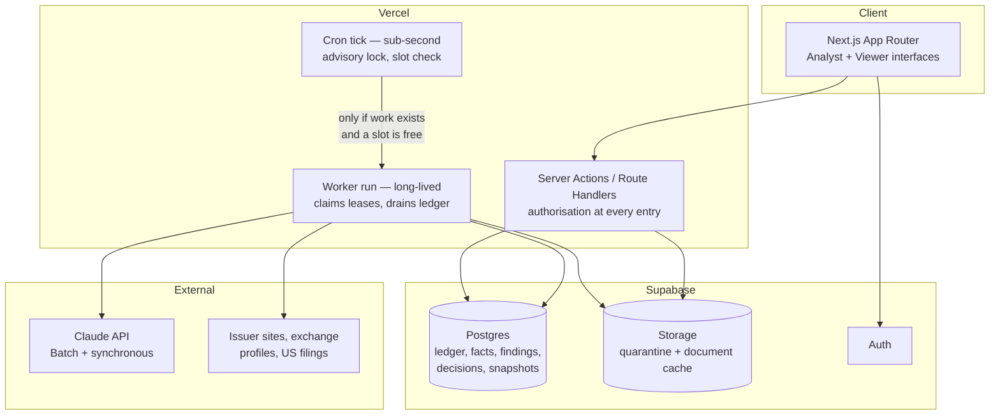
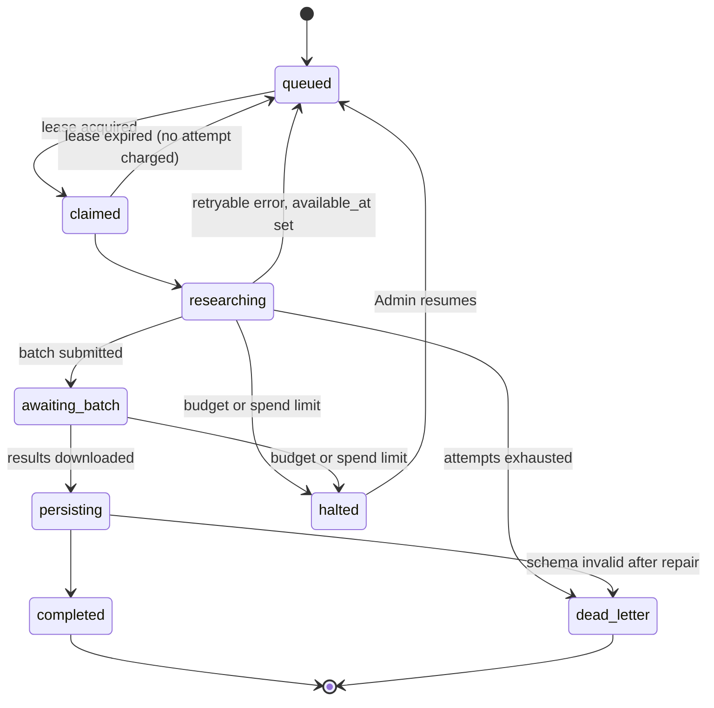

# Durable state lives in Postgres so the compute host stays replaceable

## The decision

**A job ledger in Postgres is the authoritative queue. A stateless Node worker drains it. Enrichment model calls go through the Batch API.**

Nothing durable lives in a vendor-specific workflow engine. The worker is ordinary Node code with no platform bindings, so the same binary runs under a cron-invoked function today, as a long-lived process locally, and on a container service after the move to Deloitte infrastructure. That is the whole of the "configuration change, not a rewrite" commitment for the background tier.

### Why not the alternatives

| Option | Rejected because |
|---|---|
| Third-party durable workflow service | Adds a vendor whose data is hosted in a single foreign region with no regional option. For a pilot holding client-pursuit data that is a review liability and an obstacle to the later migration |
| Platform-native durable workflows | **Portability**, not defect. It is a capable product; committing durable state to it would put the migration back on the table. An earlier draft of this design claimed its state layer does not work on serverless — that claim could not be substantiated and has been withdrawn |
| Edge functions as the primary worker | A different runtime from the application, with a low CPU ceiling and a small memory envelope. Viable as a fallback host, not as the primary one |

The honest summary: two of these are good products, and the deciding criterion is that this system must be portable to Azure on someone else's timetable.

## Components



**The tick and the worker are separate functions.** This is not cosmetic. A cron firing every minute at a function that runs several hundred seconds produces roughly a dozen concurrently live workers. If each applies its own concurrency limit, actual concurrency is the product of the two — which exhausts rate limits immediately and bills compute around the clock even when the ledger is empty. The tick therefore does almost nothing: it takes an advisory lock, asks whether work exists and whether a worker slot is free, and returns without invoking anything when the answer is no.

**Global concurrency is enforced in Postgres, not in worker memory.** Workers lease a slot row before claiming any job and exit if none is free. The API rate governor is a token bucket in a table, debited on claim against an estimated cost and reconciled from actual usage on completion. In-process governors do not compose across instances.

## The enrichment run

```mermaid
sequenceDiagram
    participant T as Cron tick
    participant W as Worker
    participant PG as Postgres
    participant B as Batch API
    T->>PG: try_advisory_lock, count pending, count free slots
    T->>W: invoke (only if work and slot)
    W->>PG: claim worker slot, claim jobs (SKIP LOCKED + lease)
    loop every 30s while holding jobs
        W->>PG: heartbeat — extend lease_expires_at
    end
    W->>W: discovery + document fetch, cache by content hash
    W->>B: submit batch (extraction, one request per company-field-group)
    W->>PG: persist batch_id, mark jobs awaiting_batch, release slot
    Note over W,B: worker exits; nothing is held open
    T->>W: later tick
    W->>B: poll batch status
    B-->>W: results
    W->>PG: persist raw results (job_results), then derive findings
    W->>PG: anchor each finding; quarantine failures
```

**Research is split from persist.** A validated model response is written to a raw results table *before* findings are derived from it. A crash between the two therefore costs nothing: the retry reads the stored response instead of paying for the call again. This is the single cheapest reliability property in the design.

## The Batch API changes the shape of the problem

The quarterly run is 259 companies, latency-insensitive, with no human waiting. That is the textbook batch workload, and using it halves both input and output price while removing the job architecture's hardest constraint: **the longest worker unit collapses to submit, poll, download**, each measured in seconds. Per-job and per-worker deadlines stop being load-bearing, and a modest function duration becomes sufficient.

Constraints to design around: batches expire after 24 hours; results are retained 29 days, so they must be downloaded and persisted rather than treated as an archive; and streaming and cache pre-warming are rejected inside a batch. Use the one-hour cache lifetime there, since batch runs routinely exceed the short window.

The synchronous path is retained for exactly two cases: **single-company replay** while an Analyst watches, and **conflict adjudication** once review has begun.

## Job state machine



**Lease expiry is not a failure.** It does not increment the attempt counter, so a deploy mid-run or a killed instance never consumes a job's retry budget. Only genuine errors do.

## Failure handling

| Condition | Classification | Behaviour |
|---|---|---|
| 429 with `retry-after` | Retryable | Honour the header, jittered backoff |
| 429, error code `enforced_spend_limit_reached` | **Halt run** | Tier cap. No `retry-after`; resets monthly |
| **400, message beginning "You have reached your specified API usage limits"** | **Halt run** | **A self-set org or workspace limit.** See below |
| 529 overloaded | Retryable | Backoff; does not count as an attempt |
| In-band search or fetch error inside a 200 | **Per-code table** | See below |
| Schema invalid | One repair retry, then dead-letter | Never a silent drop |
| `stop_reason: "refusal"` | Dead-letter with reason | Returns HTTP 200; must be checked before reading content |

**The spend-limit trap.** The limit a pilot actually configures returns **HTTP 400**, not 429. Every reasonable classifier treats a 400 as permanent, so the first time it trips mid-run the ledger would mark every remaining company permanently failed and dead-letter the run — with no log line explaining why. Both spend-limit shapes must route to a third outcome class beside retryable and permanent: **halt the run, release leases without incrementing attempts, surface the resume condition.**

**In-band tool errors are not uniformly retryable.** They arrive inside a successful HTTP response as error blocks, and treating them all as retryable re-spends the whole request's tokens for nothing. Retryable: rate-limited, temporarily unavailable, and arguably an unreachable URL. Not retryable: a URL absent from prior context, a blocked domain, invalid tool input, an over-length URL or query, an unsupported content type, or an over-large request. Exceeding the tool's use cap needs a configuration change, not a retry. Build this as an explicit per-code table with a contract test.

## Idempotency

Three separate concerns, each with its own key. Collapsing them is why the naive design's forced replay silently does nothing.

| Concern | Key | Rule |
|---|---|---|
| Model spend | `(job_id, attempt, generation)` | Deduplicated at the token boundary; a stored raw result is reused rather than re-purchased |
| Finding visibility | `(company_id, field, run_id, attempt)` | **Append-only.** A view selects the current non-superseded proposal |
| Human decisions | `(period_id, company_id, field)` | Never written by the pipeline under any circumstance |

An accepted or overridden value is never a target of any pipeline write. Section 6 enforces that in the database rather than in application code, because it is the invariant most likely to be broken by a well-meaning refactor.

## Observability

Per model call the system records the run, job and attempt, the prompt version, the exact model string, every tool version string, effort and thinking configuration, the output schema hash, the response **request identifier** (the only handle a vendor support case can use), the full usage block including cache reads and server-tool call counts, and the stop reason. Per fetched document: URL, final URL after redirects, status, content type, retrieval time, byte and extracted-text hashes, and extractor name and version. Per finding: the anchor result and the matched window.

Two traps worth naming. Search results carry encrypted content that must be replayed **byte-exact** or a continuation request fails, so a replay cannot reconstruct the assistant turn and must store it verbatim. And batch results vanish after 29 days, so the archive silently empties one month after each quarterly run unless results are persisted.

**Cache hit rate is a first-class metric**, not a curiosity: it is the difference between roughly ten and thirty cents per company, and a silent regression looks exactly like normal operation.

## Stalled runs must be visible

Cron delivery is best-effort, so a missed tick produces no error — just a run that stops advancing. The tick therefore writes a heartbeat even when it does nothing. After three consecutive missed minutes a run's derived status becomes **Stalled**, with a banner and an alert. Run states are explicit and user-visible: queued, running, stalled, halted, completed, completed with errors, failed. Never a bare spinner.

Partners are insulated from all of this: a Viewer reads only the published snapshot, so an in-flight run cannot change what they see, and the dashboard header states which period is published, when and by whom.
