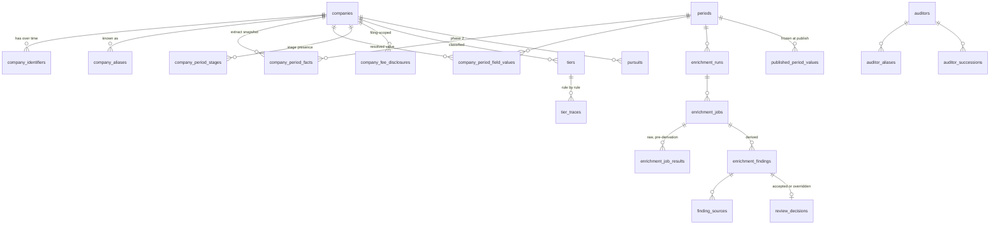

# One resolved-value table is the only thing anything reads

## The shape of the problem

Four forces determine this schema, and three of them are absent from the brief:

1. Values arrive from four different origins — the extract, an accepted AI finding, a manual entry, or inheritance — and **two of the most-used columns never produce a finding at all**, so a decisions table keyed to findings has nowhere to store them.
2. **Stage is tri-state.** Blank means not researched. A boolean cannot express that, and `Unclassified` is underivable without it.
3. **Companies change ticker and exchange.** 98 rows carry a venture-graduate flag, so identity cannot be a composite key.
4. **Fees are filing-scoped**, not period-scoped.

## Entity model



## Identity

```sql
create table companies (
  id                    uuid primary key default gen_random_uuid(),
  canonical_name        text not null,
  incorporation_country char(2),
  first_seen_period_id  uuid references periods(id),
  status                text not null default 'active'
                          check (status in ('active','merged','delisted')),
  merged_into_id        uuid references companies(id),
  created_at            timestamptz not null default now()
);

-- Identifiers are intervals, never a composite key. A venture graduation
-- closes one interval and opens another against the SAME company.
create table company_identifiers (
  id           uuid primary key default gen_random_uuid(),
  company_id   uuid not null references companies(id),
  scheme       text not null check (scheme in
                 ('root_ticker','ric','sp_entity_id','sedar_issuer_no','lei')),
  value        text not null,
  exchange     text,
  valid_from   date not null,
  valid_to     date,
  source       text not null,
  unique (scheme, value, exchange, valid_from)
);
create index on company_identifiers (scheme, value) where valid_to is null;

create table company_aliases (
  company_id      uuid not null references companies(id),
  name            text not null,
  name_normalized text not null,
  alias_type      text not null check (alias_type in ('legal','former','source_variant')),
  first_seen_period_id uuid references periods(id),
  source          text not null,
  primary key (company_id, name_normalized)
);
```

Two notes. The **entity identifier from the auditor tab is a first-class scheme here** — 143 real values, the only stable non-ticker identifier in the corpus, and the reason the match cascade does not fall back to ticker for the whole population. And aliases are seeded from cross-source name variants that actually exist, since the workbook contains no rename history to import.

## Periods and the extract snapshot

```sql
create table periods (
  id                 uuid primary key default gen_random_uuid(),
  label              text not null unique,
  market_cap_as_of   date not null,          -- parsed from the header, never the tab name
  threshold_amount   numeric(20,4) not null default 200000000,
  threshold_operator text not null default 'gte' check (threshold_operator in ('gt','gte')),
  threshold_currency char(3) not null default 'CAD',
  proximity_band_pct numeric(5,2) not null default 5.00,
  status             text not null default 'draft'
                       check (status in ('draft','enriching','in_review','published')),
  revision           int  not null default 1,
  source_file_sha256 text,
  published_at       timestamptz,
  published_by       uuid references app_users(id)
);

-- Immutable typed snapshot of what the file said. Never updated in place.
create table company_period_facts (
  period_id    uuid not null references periods(id),
  company_id   uuid not null references companies(id),
  field_key    text not null,
  raw_value    text,                 -- exactly as read, before normalisation
  typed_value  jsonb,                -- after normalisation; null if sentinel
  assertion    text not null check (assertion in
                 ('asserted','absent_blank','absent_sentinel','column_absent')),
  primary key (period_id, company_id, field_key)
);
```

The `assertion` column is what makes a safe re-upload possible. **`column_absent` asserts nothing** and must leave a prior value standing; only `absent_blank` and `absent_sentinel` assert that a value is genuinely missing. Conflating them is what silently deletes the five analyst-added region values.

The threshold carries its **operator**, because the workbook states it three ways and the comparison itself is ambiguous. The proximity band drives the entrant and drop-out view, since two companies sit under 1% above the line.

## The resolved-value table

This is the table the brief omits and everything else depends on.

```sql
create table company_period_field_values (
  period_id      uuid not null references periods(id),
  company_id     uuid not null references companies(id),
  field_key      text not null references field_catalog(key),
  value          jsonb,
  source         text not null check (source in
                   ('extract','ai_accepted','manual_override','manual_entry',
                    'derived','inherited')),
  evidence_state text not null check (evidence_state in
                   ('asserted','absent_confirmed','unknown')),
  finding_id     uuid references enrichment_findings(id),
  source_period_id uuid references periods(id),     -- for inherited
  rule_version   text,                              -- for derived
  basis_hash     text,        -- hash of the inputs this decision was made against
  actor_id       uuid references app_users(id),
  decided_at     timestamptz not null default now(),
  frozen_at      timestamptz,
  primary key (period_id, company_id, field_key)
);
```

`manual_entry` is the value that unblocks the two manual-only columns — the Deloitte market, populated for 209 rows, and the tax-client flag, populated for 29. Neither will ever have a finding, so under a findings-keyed decisions model neither could be stored or attributed at all.

**Precedence is enforced in the database, not in application code**, because it is the invariant a refactor is most likely to break:

```sql
-- Promotion of extract values may only ever overwrite other extract values.
insert into company_period_field_values as v (...)
values (...)
on conflict (period_id, company_id, field_key) do update
  set value = excluded.value, decided_at = now()
  where v.source = 'extract'          -- never touches an override or an accepted finding
    and v.frozen_at is null;
```

```sql
create table field_catalog (
  key            text primary key,
  label          text not null,
  data_type      text not null,
  origin         text not null check (origin in
                   ('extract','ai_enriched','manual','derived')),
  classification text not null check (classification in
                   ('public','deloitte_internal')),
  stale_after_days int,
  bulk_acceptable  boolean not null default true
);
```

`field_catalog` must be a **table, not a TypeScript constant**, because the row-level policy that hides internal fields from a Viewer references it (below), and because `bulk_acceptable` is how the fee fields are excluded from bulk accept without special-casing them in the interface.

## Stage is presence rows plus an evidence state

```sql
create table company_period_stages (
  period_id  uuid not null references periods(id),
  company_id uuid not null references companies(id),
  stage      text not null check (stage in
               ('exploration','development','production','royalty_streaming')),
  primary key (period_id, company_id, stage)
);
```

Absence of a row means "false" **only** when the company's `stage_evidence_state` is `complete`. That state lives in the resolved-value table under its own field key. On day one it is `none` for 242 of 259 companies, and that is the honest input to the classifier.

## Fees are filing-scoped

```sql
create table company_fee_disclosures (
  id               uuid primary key default gen_random_uuid(),
  company_id       uuid not null references companies(id),
  fee_type         text not null check (fee_type in
                     ('audit','audit_related','tax','other')),
  fiscal_year_end  date not null,
  amount           numeric(20,2),
  currency         char(3),
  amount_cad       numeric(20,2),
  fx_rate_id       uuid references fx_rates(id),
  conversion_status text not null default 'ok'
                     check (conversion_status in ('ok','no_rate','not_applicable')),
  source_url       text,
  source_doc_type  text,
  excerpt          text,
  finding_id       uuid references enrichment_findings(id),
  unique (company_id, fee_type, fiscal_year_end)
);
```

The period view selects the row with the greatest fiscal year end at or before the period's as-of date. The tax-to-audit ratio is emitted **only when both fees share a fiscal year end**, and null with a reason otherwise. Storing fees per period would duplicate a filing-scoped fact four times a year and make "did the fee change?" unanswerable.

## Auditors are an entity, not a lookup of strings

```sql
create table auditors (
  id             uuid primary key default gen_random_uuid(),
  canonical_name text not null unique,
  firm_class     text not null check (firm_class in
                   ('big4','national','regional','unknown'))
);
create table auditor_aliases (
  auditor_id uuid not null references auditors(id),
  raw_value  text not null,
  normalized text not null unique,
  primary key (auditor_id, normalized)
);
create table auditor_successions (
  predecessor_id uuid not null references auditors(id),
  successor_id   uuid not null references auditors(id),
  effective_date date not null,
  kind           text not null check (kind in ('merger','rebrand','network_change')),
  primary key (predecessor_id, successor_id, effective_date)
);
```

Resolution order is fixed and testable: **trim → collapse → casefold → sentinel lookup → alias lookup → unresolved queue.** `firm_class` is a property of the firm, never of the spreadsheet column a value happened to land in — which is what stops a non-Big-4 firm sitting in the Big-4 column from being counted as Big-4, and folds two spellings of the same firm together.

Two relationships that the workbook conflates and this schema separates: the firm **audits** 17 companies, and has **28 tax clients** with only six names in common. They are different relationships and both feed whitespace. The tax-client flag is tri-state:

```sql
alter table companies add column deloitte_tax_client text not null default 'not_checked'
  check (deloitte_tax_client in ('yes','no','not_checked'));
```

230 of 259 rows are blank in the source, and blank means **never checked**, not "no". Collapsing them makes every whitespace count wrong by up to 230.

## FX fails loudly

```sql
create table fx_rates (
  id           uuid primary key default gen_random_uuid(),
  currency     char(3) not null,
  rate_date    date not null,
  rate_to_cad  numeric(18,8) not null,
  source       text not null check (source in ('boc_month_end','boc_daily','manual','legacy_workbook')),
  retrieved_at timestamptz not null default now(),
  unique (currency, rate_date)
);
```

`fx_rate_for(currency, on_date, max_staleness_days)` returns the nearest prior rate **or null**. There is no carry-forward beyond tolerance. A conversion with no rate stores a null amount and `conversion_status = 'no_rate'`, and the dashboard shows an explicit unconverted count rather than a silently understated total.

The workbook's own rates are ingested at most as `legacy_workbook` reference and can never satisfy a conversion: two disjoint blocks, one empty month, one missing month, currency identity positional in one of them, and nothing within 22 months of the data date.

## Classification output

```sql
create table tiers (
  period_id  uuid not null references periods(id),
  company_id uuid not null references companies(id),
  tier       smallint check (tier between 1 and 6),
  status     text not null check (status in
               ('classified','unclassified_no_stage_evidence',
                'unclassified_no_property_evidence','unclassified_conflicting')),
  footprint  text not null check (footprint in
               ('canada_only','abroad','canada_and_abroad','none')),
  rule_set_version text not null,
  computed_at timestamptz not null default now(),
  primary key (period_id, company_id)
);
create table tier_traces (
  period_id uuid not null, company_id uuid not null,
  ord smallint not null, rule_id text not null,
  inputs jsonb not null, matched boolean not null,
  primary key (period_id, company_id, ord)
);
```

Tier is **nullable with a status**, not a seventh enum value, because unclassified has two independent causes that route to different review queues. The trace is **structured rows, not a sentence**, so the migration view can say which rule changed rather than diffing prose.

## Enrichment

```sql
create table enrichment_findings (
  id            uuid primary key default gen_random_uuid(),
  run_id        uuid not null references enrichment_runs(id),
  job_id        uuid not null references enrichment_jobs(id),
  attempt       int  not null,
  company_id    uuid not null references companies(id),
  field_key     text not null references field_catalog(key),
  proposed_value jsonb,
  evidence_strength numeric(4,3),      -- computed; see section 6
  model_self_confidence numeric(4,3),  -- recorded, excluded from thresholds
  anchor_mode   text not null check (anchor_mode in
                  ('exact_normalized','proximity','label_only','none')),
  state         text not null check (state in
                  ('proposed','anchor_mismatch','unsupported',
                   'no_text_layer','source_unreachable','superseded')),
  model         text not null, prompt_version text not null,
  request_id    text, usage jsonb,
  created_at    timestamptz not null default now(),
  unique (company_id, field_key, run_id, attempt)
);
```

**Append-only.** The uniqueness key includes attempt, so a forced replay produces a new visible finding instead of silently doing nothing — the failure mode of keying on company and field alone with a do-nothing conflict clause. A view selects the current non-superseded proposal. Spend deduplication happens one layer down, on the raw results table, which is where it belongs.

```sql
create table review_decisions (
  id         uuid primary key default gen_random_uuid(),
  period_id  uuid not null, company_id uuid not null, field_key text not null,
  decision   text not null check (decision in ('accept','override','flag')),
  override_value jsonb, reason text,
  finding_id uuid references enrichment_findings(id),
  finding_version int,        -- binds the decision to the proposal it judged
  actor_id   uuid not null references app_users(id),
  decided_at timestamptz not null default now()
);
```

`finding_version` matters: without it, an override silently re-binds to a later proposal and the audit trail no longer says what the Analyst actually saw.

## Publish freezes a snapshot

```sql
create table published_period_values (
  publication_id uuid not null references period_publications(id),
  company_id uuid not null, field_key text not null,
  value jsonb, source text not null,
  finding_id uuid, sources jsonb, excerpt text,
  model text, prompt_version text, evidence_strength numeric(4,3),
  primary key (publication_id, company_id, field_key)
);
```

Roughly 259 companies by 15 fields is about 4,000 rows per period — trivial to store, and it buys three things: dashboards become a single-table group-by that holds under a second as periods accumulate; precedence is resolved **once**, in one place, so it cannot diverge between a dozen queries; and a published period becomes genuinely immutable, which is what makes period comparison trustworthy. Corrections after publish are amendments that bump the revision, never in-place mutations.

## Column provenance

| Column group | Origin | Notes |
|---|---|---|
| Company, ticker, exchange, market cap, HQ | Extract | Identity re-keyed on ingest |
| Region columns | **Extract, mostly** | Five values are analyst-added; three-way merge required |
| Commodity flags | Extract | Plus free-text `Other Properties` unioned in |
| Stage flags | **AI-enriched** | Blank for 242 of 259 today |
| Auditor, website, summary | AI-enriched | Auditor partially seeded from the extract |
| Audit and tax fees | AI-enriched | Source columns empty; fields still required |
| Deloitte market | **Manual** | Mapping-driven; versioned mapping table |
| Deloitte tax client | **Manual, internal** | Tri-state; never enters a prompt |
| Tier, footprint, Canada-vs-abroad | **Derived** | Rule-set versioned, trace stored |
| Prior tier, changed flag | Derived | Computed from the prior snapshot, not imported |

## Access control

Row policies cannot hide **columns**, and the internal fields are columns. Three mechanisms together:

```sql
-- 1. Internal fields are excluded by field_key, which is why field_catalog is a table.
create policy viewer_reads_public_published on company_period_field_values
for select to app_viewer using (
  exists (select 1 from periods p
          where p.id = period_id and p.status = 'published')
  and field_key not in (select key from field_catalog
                        where classification = 'deloitte_internal')
);

-- 2. Draft data is unreachable regardless of role predicate, on EVERY period-scoped table.
create policy analyst_reads_any_period on tiers
for select to app_analyst using (true);
create policy viewer_reads_published_tiers on tiers
for select to app_viewer using (
  exists (select 1 from periods p where p.id = period_id and p.status = 'published')
);

-- 3. Viewers are denied outright on the pipeline's own tables.
revoke all on enrichment_runs, enrichment_jobs, enrichment_findings,
               enrichment_job_results, review_decisions, tier_traces from app_viewer;
```

Missing the period-status join on `tiers` alone leaks the entire draft classification, so it belongs on every period-scoped table rather than only on the obvious ones. Where a dashboard tile needs a count over restricted data, expose it through a `security definer` aggregate function rather than relaxing a policy.

**The worker does not hold the service-role key.** It gets its own role with the narrowest possible grants, and column privileges revoked so the restriction is mechanical rather than conventional:

```sql
create role enrichment_worker nologin;
grant select on companies, company_period_facts, company_identifiers to enrichment_worker;
revoke select (deloitte_tax_client) on companies from enrichment_worker;
grant insert on enrichment_findings, enrichment_job_results, finding_sources to enrichment_worker;
grant insert on audit_log to enrichment_worker;
-- deliberately absent: any grant on review_decisions or company_period_field_values
```

A prompt-injected agent therefore cannot manufacture an accepted value, because the role it runs as has no path to the table that stores one.

## Audit trail covers four kinds of change, not one

A review decisions table answers "who accepted this". It does not answer "why did this tier change when nobody touched it", which happens when a **rule set** or a **mapping table** changes — and editing the market mapping silently rewrites up to 209 rows.

```sql
create table audit_log (
  id bigserial primary key,
  table_name text not null, pk jsonb not null, field_key text,
  old_value jsonb, new_value jsonb,
  actor_id uuid, actor_role text,
  actor_kind text not null check (actor_kind in ('user','worker','system')),
  reason text, evidence_ref text, run_id uuid, rule_version text,
  occurred_at timestamptz not null default now()
);
revoke update, delete on audit_log from public;
```

Reference data is versioned alongside it — `dtt_market_map(version, hq_code, hq_kind, market, valid_from)` and `tier_rule_sets(version, definition, activated_at, activated_by)` — and every derived value records the version it was computed under. That is what turns "who changed this value" into an answerable question for a derived cell.

## Identity and the Azure move

```sql
create table app_users (
  id uuid primary key default gen_random_uuid(),
  external_subject text unique,     -- the ONLY thing that changes on migration
  email citext not null unique,
  role text not null check (role in ('admin','analyst','viewer')),
  active boolean not null default true
);
create function app_current_role() returns text language sql stable as $$
  select role from app_users where external_subject = auth.jwt()->>'sub' and active
$$;
```

Every policy resolves the role through `app_current_role()` and never reads the identity provider's own tables. Swapping magic-link sign-in for Deloitte's provider changes the claim source and nothing else. The indirection looks gratuitous at pilot scale and is the entire substance of the portability commitment.

## Phase 2 pursuit tables

They ship in Phase 1 **empty but policied**, because a table with no interface is still reachable through the data API:

```sql
create table pursuits (
  id uuid primary key default gen_random_uuid(),
  company_id uuid not null references companies(id),
  priority text,
  owner_id uuid references app_users(id),
  created_at timestamptz not null default now()
);
create table pursuit_notes   (id uuid primary key, pursuit_id uuid not null, body text,
                              author_id uuid, created_at timestamptz not null default now());
create table pursuit_actions (id uuid primary key, pursuit_id uuid not null, description text,
                              due_date date, owner_id uuid, status text);
revoke all on pursuits, pursuit_notes, pursuit_actions from app_viewer;
```

**`lcsp` and `fy_tax_nsr` were specified here and are not built** (Samuel's decision, 13 September 2026). An LCSP is a person's name and a tax NSR is Deloitte's own revenue from a client — the class of data this build already refuses, the `Deloitte Tax Client` column having been removed at parse time for the same reason. An empty column is an invitation. Phase 2 may add either, on the firm's own due diligence, which is the condition the tax-client flag carries. Migration `0018` states the same, so the schema and this document do not disagree by accident.

The source tracker is an empty template, so there is nothing to migrate. Do **not** seed the tier vocabulary from it — it lists five tiers and omits exploration entirely, which would silently delete a tier from the model.
